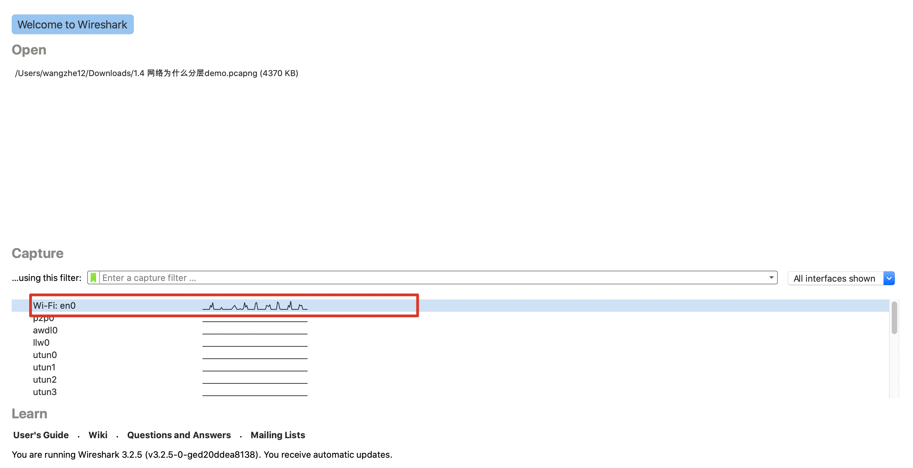
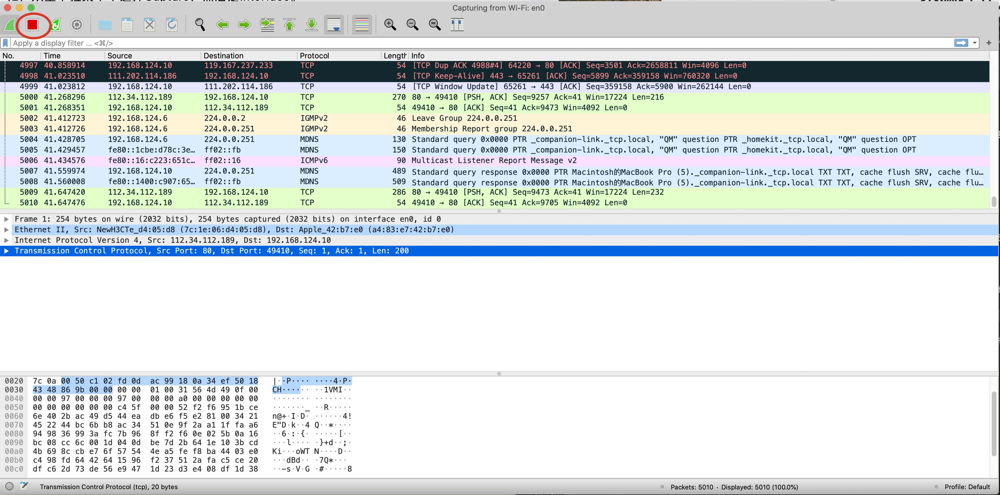
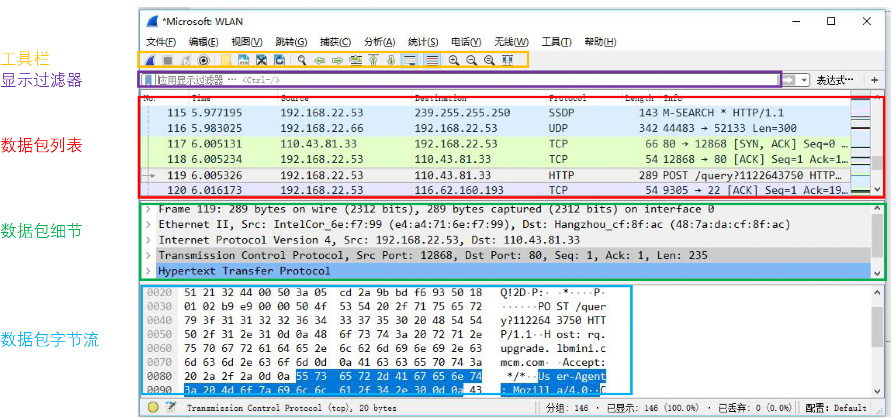
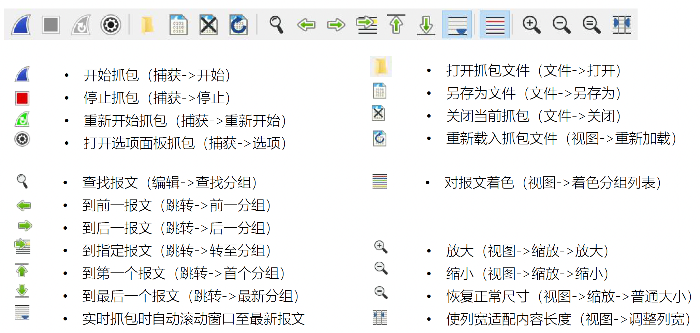
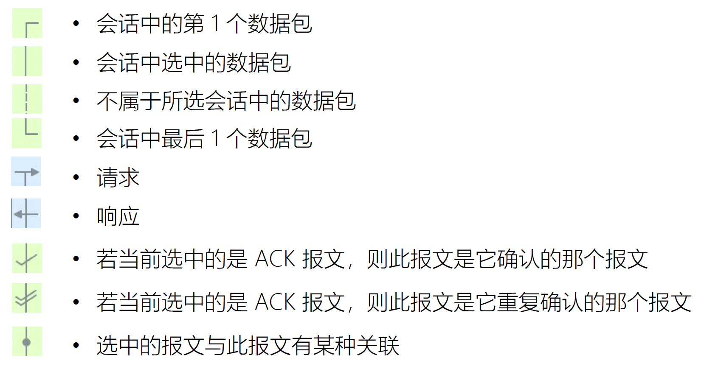
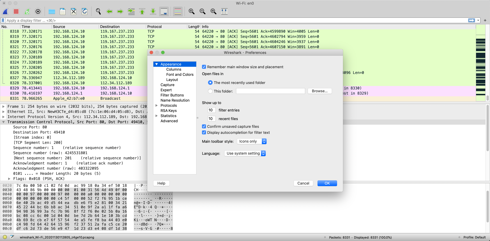
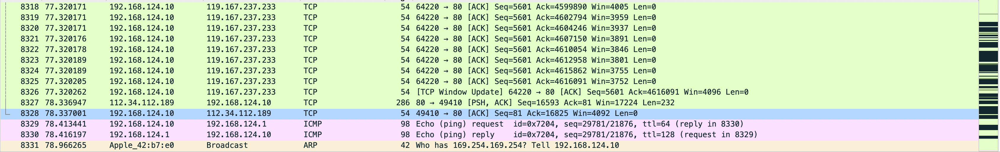
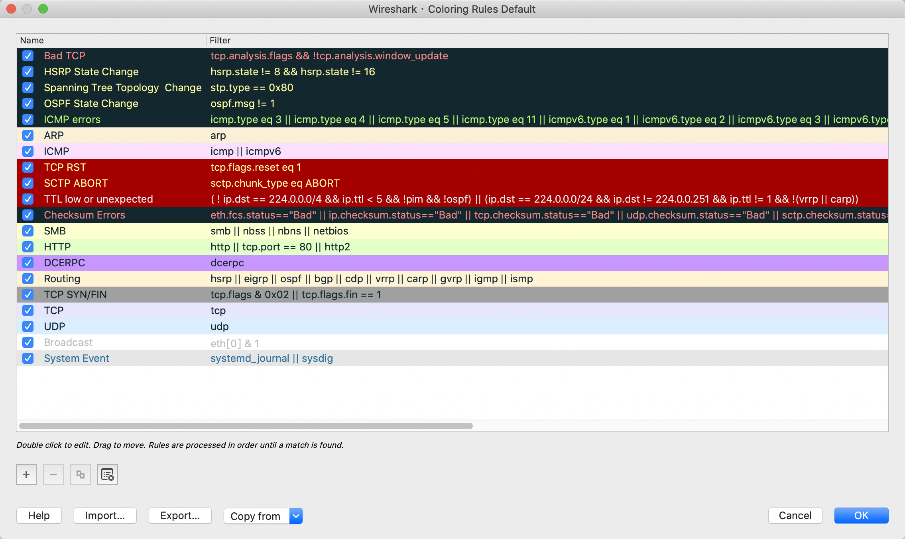
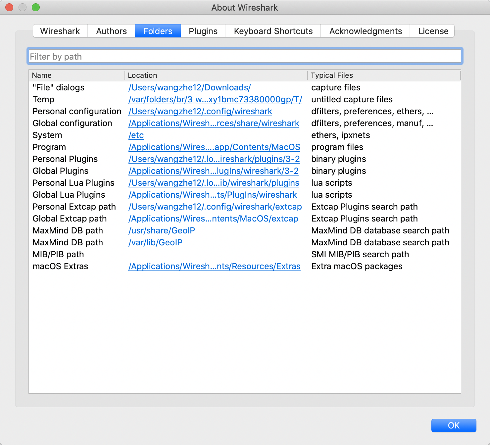
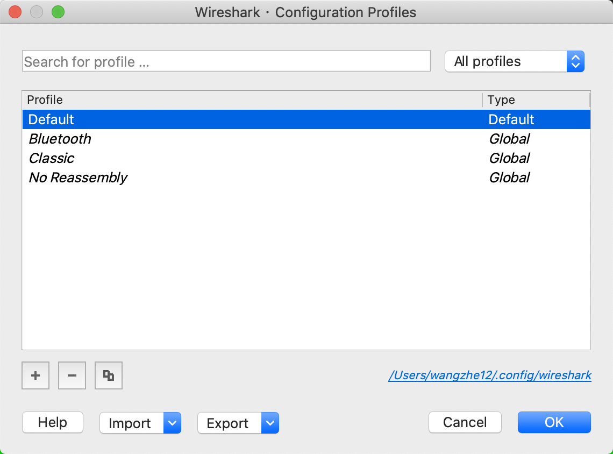

# Wireshark快速入门

当你成功安装了Wireshark之后，我们就可以开始使用它了。
但是当你首次打开这个软件时，你确发现你看不到任何的数据包，下面我们来一步步进行相关知识的学习吧。

## 捕获第一个数据包

下面，我们来捕获一些数据包！

第一步：打开Wireshark

第二步：从Capture的设备列表中找出一的网卡设备，然后双击进入，如下图所示。

第三步：等1min左右，当你打算停止捕获并查看你的数据时，操作拦中单击Stop按钮即可。

当你完成上述步骤后，Wireshark的主窗口中应该已经呈现了相应的数据，但是这些数据可能会非常难以理解，下面我们来依次对数据进行讲解。

## Wireshark主窗口

下面，我们来详细学习一下Wireshark的主窗口，如下图所示：

在主窗口中，包含着三部分面板，从上到下依次是：

1. 工具栏
2. 显示过滤器
3. Packet List
4. Packet Detail
5. Packet Bytes

如果我们希望在Packet Detail面板中查看一个单独的数据包具体内容，那么首先需要在Packet List单击选择对应的数据包。
在选中了数据包之后，你可以在Packet Details面板中选中数据包的某个字段，从而可以在Packet Bytes面板中查看相应的字节信息。

PS：在Packet List中，针对每个包请求都列出了对应的协议，但是并没有使用不同的层次来对不同的协议进行视觉上的区分，
所有的数据包都是按照其在链路上的接收顺序排列的。

下面，我们依次来详细介绍每个面板的内容。

### 工具栏

### Packet List（数据包列表）

Packet List中显示了当前捕获文件中所有的数据包，其中包括了
数据包序号、数据包被捕获时的相对时间、数据包的源地址和目标地址、数据包的洗协议以及数据包的概况信息等。

### Packet Detail（数据包细节）

Packet Detail详细显示了一个数据包的内容，并且可以通过展开或者收缩来显示这个包捕获的全部内容。

### Packet Bytes（数据包字节）

Packet Bytes的内容可能是让人最难以理解的，因为它显示的是一个数据包未经过处理的原始数据格式，也就是在链接上传播时的内容。

### 数据包列表面板的标记符号

## Wireshark偏好设置

Wireshark提供了一些配置项可以让你根据个人需要进行定制。
如果需要设置Wireshark的配置，可以在主菜单中选择Preferences，然后就可以看到对应的配置框，如下图所示：

Wireshark的配置项主要包含如下几部分内容。

### Apperance（外观）

此处的配置主要用于决定Wireshark中数据的显示方式。
你可以根据个人的喜好对大多数配置进行调整，例如窗口布局、滚动条的位置、字体、前景色和背景色等。

### Capture（捕获）

此处的配置可以让你对自己捕获的数据包的方式进行特殊的设定，比如你的默认设备、是否默认使用混杂模式、是否实时更新Packet List面板等。

### Filter Expressions（过滤器表达式）

此处的配置可以让你生成和管理你自己的过滤器。

### Name Resolutions（名称解析）

通过这些设定，你可以开启Wireshark将地址解析成为一些更容易分辨和理解的别名。
并且，你还可以设定并发处理名称解析请求的最大数目。

### Protocols（协议）

这一部分中的选项可以让你调整关于捕捉和显示各种Wireshark解码数据包的功能。
虽然并不是针对每一个协议都可以进行调整，但是大部分协议的选项都可以进行更改。
不过，通过经验来看，最好让他们保持默认值就行。

### Statistics（统计）

这一部分提供了Wireshark中统计功能的相关配置选项，后续会进行深入的学习。

### Advanced（高级）

除了上述配置之外的其他配置会会放在Advanced中进行配置。
不过这些配置一般只有Wireshark的高级用户才能去修改。

## 数据包彩色高亮

在Wireshark的Packet List面板中，针对不同的数据包显示的颜色各不相同。

不过这些数据包的颜色并不是随机分配的，而是大有讲究的。
这些数据包根据协议的不同而对应着不同的颜色。
例如，所有的DNS流量都是蓝色的，而HTTP流量的颜色都是绿色的。

通过不同的颜色可以快速将不同协议的数据包快速分开，而不需要依次查看每个数据包的具体协议，
这样可以大量节省时间。

如下图所示，Wireshark通过Coloring Rules窗口（View菜单下）可以轻松查看每个协议对应的颜色。

同时，你还可以创建属于你自己的着色规则或修改已有的规则。

例如，通过如下步骤，我们可以将HTTP流量的颜色由绿色改成淡紫色。

1. 打开Wireshark，打开Coloring Rules窗口。（View -> Coloring Rules）
2. 找出HTTP着色规则并单击选中
3. 单击Foreground或者Background修改前景色或背景色
4. 修改完成后单击OK保存即可。

## 配置文件

当我们想要修改配置时，知道Wireshark的配置文件存储位置对于我们的理解是很有帮助的。
想要找到该文件，可以在下拉菜单中单击Help并找出About Wireshark，然后单击Folder标签卡。
如下图所示：

Wireshark的个性化设置中最重要的两个位置是个人和全局设置目录。
全局设置包含着所有的默认配置选项。
个人设置目录中只包含了针对你的账户的配置。任何你做的相关配置都使用你的账户存储在个人配置文件夹下。

## 配色方案

学习了Wireshark的参数配置后，有时你会发现你想要在不同场景使用不同的配置。
这时，Wireshark提供了一种个性化配置方案，可以让用户保存一组配置。

一个配置方案种存储了下面的配置信息：

1. 参数选项
2. 捕获过滤器
3. 显示过滤器
4. 着色规则
5. 禁用协议
6. 强制解码
7. 最近的配置，例如窗口大小、菜单设置和列宽
8. 协议自定义信息头

我们可以在主菜单下单击EDIT，选择Configuration Profiles选项。

此时，你就可以看到Wireshark的预设配置方案，例如默认、蓝牙、经典等。

在配置方案窗口页面种，你可以创建、复制、删除和应用配置方案。

Ps: 针对每一个配置方案，都是单独存储在一个目录种的，这也就意味着你可以快速的备份配置方案和共享给他人。
