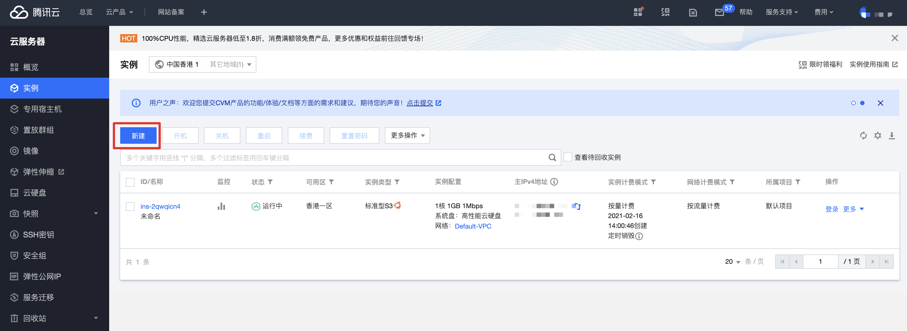
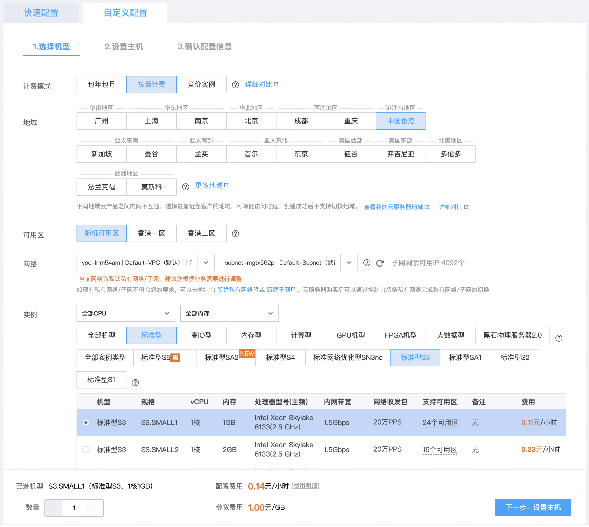
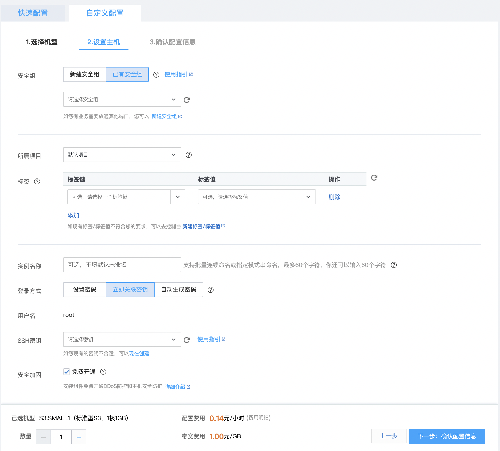
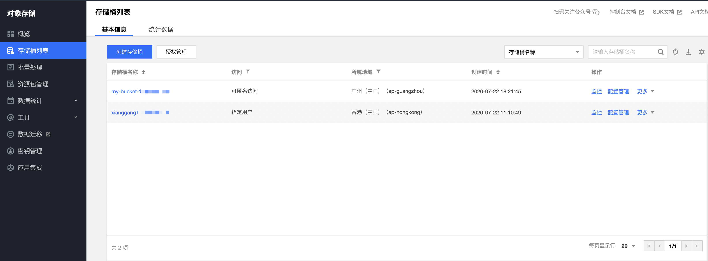
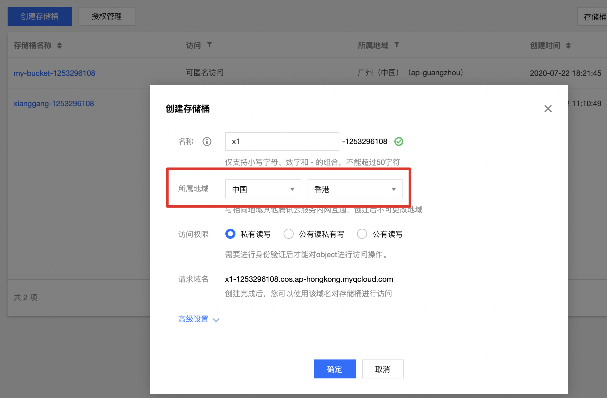
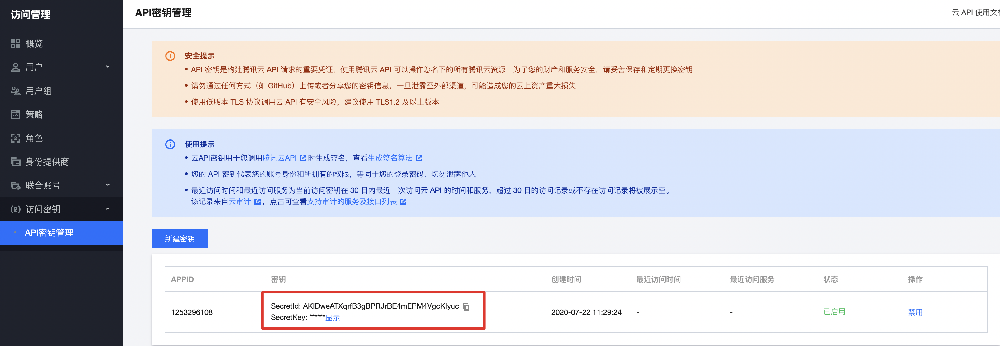
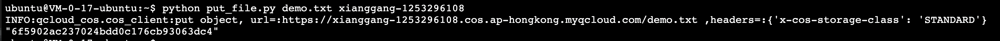

# 国内快速下载github等国外资源秘籍

作为一个国内程序员，相信你一定遇到过从 Github 上拉取代码是10kb每秒的窘境吧。

同样，可能你也会遇到过某些google软件/镜像等无法拉取下载等一系列问题。

今天我们就来分享一个小窍门，从而能快速的解决这一问题。

## 云服务

云现在已经是一个炙手可热的概念了。

国外有Amazon，Azure等云厂商，国内有阿里云、腾讯云、百度云等。

通过各个厂家的公有云服务，我们可以快速的购买虚拟机等资源，文件存储等服务。

而为了能够从 Github、Google 等国外站点快速地下载资源，我们可以通过购买云服务厂商的香港资源的虚拟机进行文件下载，再上传到公有云的文件存储服务上，再从本地就可以飞速的下载了。

在本文中，我们以腾讯云为例进行讲解。

Ps: 该方案需要一点的经费花销。

## 云服务器快速入门

首先，进入[腾讯云](https://cloud.tencent.com/) 注册并登录。

进入控制台后，选择云服务器，可以看到你的云服务列表：



点击新建按钮创建一台香港机房的云服务器:



需要注意的有以下几点：

1. 切换Tab页选择为自定义配置
2. 计费模式选择为按量计费（我们每次下载很快，为了不浪费，我们可以选择随时用随时申请）
3. 地域选择香港
4. 操作系统推荐选择Ubuntu 18.04

然后点击下一步进入设置主机页面：



在设置主机页面，需要注意的是可以将登录方式设置为设置密码，然后根据自己的需要设置即可。

最后点击下一步确认配置信息并创建即可。

创建完成后，你就能重新回到实例列表页，稍等一两分钟后，云服务器就能创建成功了，点击登录按钮，可以直接从web页面登录云服务器。

## 对象存储入门

对象存储是是一种面向文件存储的系统，非常适合于文件持久化的存储。

腾讯云的对象存储产品也叫 [COS](https://console.cloud.tencent.com/cos5) 。

使用对象存储时，首先需要进入存储桶列表。



然后创建一个 bucket 。



其中，Bucket的所属地域需要与云服务器一致，即选择香港。

### 搭建Python SDK环境

进入bucket详情页面后，我们可以看到buckets中的文件列表。

同时，也可以从web页面进行文件管理等操作。

但是，由于Web页面只能上传本地问题，而我们需要从云服务器中上传文件，因此，我们需要通过COS的SDK来进行文件上传。

首先，需要登录我们刚才购买的云服务器。

接下来，我们需要安装python的包管理工具`pip`。

```shell
sudo apt install python-pip
```

然后使用`pip`来安装COS的Python的SDK:

```shell
pip install -U cos-python-sdk-v5
```

此时，Python的SDK环境就已经搭建完成了。

一个示例的Python SDK上传文件的demo如下，创建一个`put_file.py`文件：

```python
# -*- coding=utf-8 -*-
import sys
import logging
from qcloud_cos import CosConfig
from qcloud_cos import CosS3Client

logging.basicConfig(level=logging.INFO, stream=sys.stdout)

# 1. 设置用户配置, 包括 secretId，secretKey 以及 Region
file_name = sys.argv[1]
bucket_name = sys.argv[2]

secret_id = 'xxxxxxxxxxxxxxxxxxxx'      # 替换为用户的 secretId
secret_key = 'xxxxxxxxxxxxxxxxxxx'      # 替换为用户的 secretKey
region = 'ap-hongkong'      # COS的Region
token = None                # 使用临时密钥需要传入 Token，默认为空，可不填
scheme = 'https'            # 指定使用 http/https 协议来访问 COS，默认为 https，可不填
config = CosConfig(Region=region, SecretId=secret_id, SecretKey=secret_key, Token=token, Scheme=scheme)

# 2. 获取客户端对象
client = CosS3Client(config)

# 3. 上传文件
with open(file_name, 'rb') as fp:
   response = client.put_object(
       Bucket=bucket_name,
       Body=fp,
       Key=file_name,
       StorageClass='STANDARD',
       EnableMD5=False
   )
print(response['ETag'])
```

在该脚本中，需要修改对应的secret_id 和 secret_key，他们对应着腾讯云的账号信息。

查询地址如下：

https://console.cloud.tencent.com/cam/capi



同时，上述脚本支持两个参数，分别是上传的文件名称以及Bucket的名称。

例如：

```shell
python put_file.py demo.txt xianggang-1253296108
```

上述命令表示将本地的demo.txt文件上传到xianggang-1253296108 bucket中。

输出结果如下：



此时，刷新Bucket详情页面，你应该已经可以看到文件已经正常上传至COS中了。

我们已经可以用本地浏览器直接从Web的COS页面中进行飞速下载了。
