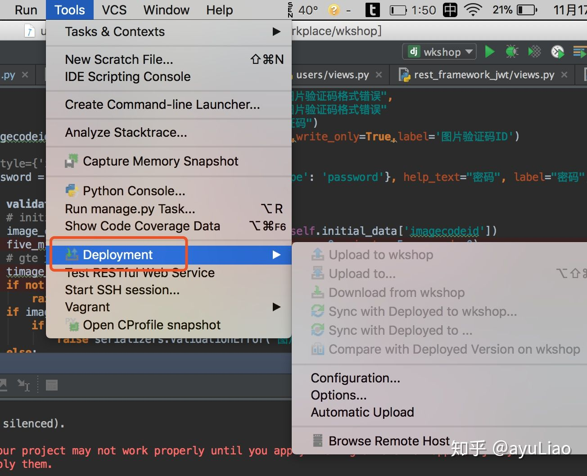

# PyCharm开启远程调试

在本文中，我们将会讲解如何使用PyCharm进行远程调试。

主要包含两个方面：

1. 远程文件同步。
2. 远程调试。

## 远程文件同步

要远程调试代码，那么就先要将代码上传到服务器上，那么上传的方式就有很多了，例如`scp`等方式。
同时，PyCharm自身提供了一种远程文件同步的方案，本节主要讲解如何使用PyCharm进行远程文件同步。

具体来说，我们在 `Tool--->Deployment` 进行配置：

此时，从图中可以看出，Upload相关的选项是灰色，这是因为你没有配置。
下面，我们选择Configuration，对PyCharm提供的SFTP进行简单的配置：

点击左上角的加号，创建一个配置，将SFTP要链接的服务器路径、服务器用户名和密码都填上，
最下面的Web server root URL 字段PyCharm会自动帮我们填写，简单的配置后，可以点击 Test SFTP connection... 按钮，判断SFTP是否可以成功链接服务器，如果返回Success，则表示服务器链接成功。

接着还要配置一下本地代码上传到服务的路径，配置好这个，代码才会上传到相应的路径:

配置完后，我们就可以进行上传了。

其中，我们可以勾选Automatic Upload实现文件变更自动同步。

## 远程调试

光上传代码是不能进行调试，因为我们在PyCharm中运行项目使用的依旧是本地的Python解释器，依旧是在本地运行，那么此时对代码进行Debug跟线上的代码没有关系，线上的代码也没有启动。
如果要远程Debug，要完成两个配置：

1. 配置PyCharm的Python解释器，使用服务器上的Python解释器。
2. 配置PyCharm的Debug功能，让PyCharm运行服务器上的代码。

这里先做第一步，进入PyCharm的配置界面，选择Prjoect XXX---> Project Interpreter，配置Python解释器，点击⚙，如下图:

然后选Add Remote，接着选中SSH Credentials，将远程服务器的地址、服务器的用户名和密码填上，然后在服务器中选择Python解释的路径，也就是 Python interpreter path：

选中完后，点击OK，PyCharm就好将远程服务器上相应Python解释器的相关文件都同步下来。
你需要等待一下，然后就会出现下面界面，观察Project Interpreter，它已经是远程服务器的Python环境了。

这样第一步就完成了，接着来配置PyCharm中的Debug，如果不配置，那么Debug依旧会使用本地的Python解释器。

打开PyCharm Debug的配置界面（Run-->Debug-->Edit Configuration...），然后配置一下当前项目下的Python interpreter，确保Debug使用远程服务器的Python解释器来运行代码。

这里有点要注意，Debug配置界面中，Host要配置为0.0.0.0，否则会出现报错。

所有都配置完后，就可以进行Debug了，此时使用的就是远程的Python解释器，Debug的也是远程的Python代码，注意观察Debug的第一行，可以发送其通过SSH连接远程服务器。

